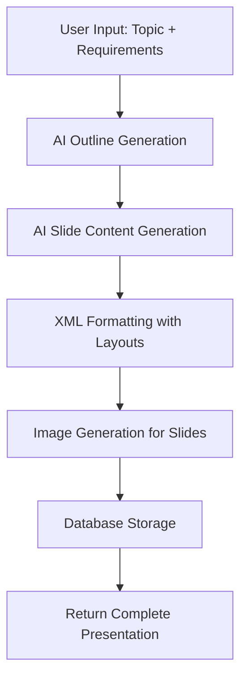
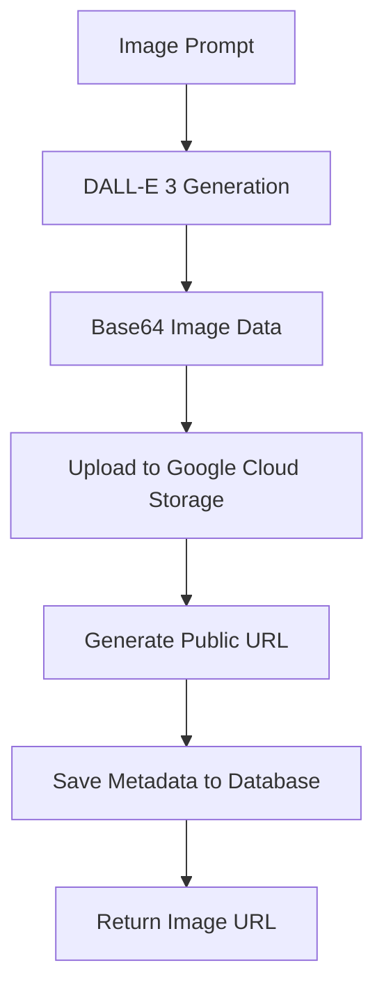

# 🎯 Presentation System Architecture Overview

## 📁 System Structure

The presentation system is a comprehensive AI-powered presentation generation platform with the following architecture:

```
app/presentation/
├── models.py                    # Pydantic models for API requests/responses
├── db_models.py                 # SQLAlchemy database models
├── routes.py                    # FastAPI endpoints
├── enhanced_routes.py           # Additional enhanced endpoints
└── service/
    ├── presentation_service.py      # Core AI presentation generation (LangChain)
    ├── presentation_db_service.py   # Database operations service
    ├── enhanced_image_service.py    # DALL-E image generation + GCS storage
    ├── google_image_service.py      # Google Images integration
    ├── improved_presentation_service.py  # Enhanced presentation logic
    └── crud.py                      # Database CRUD operations
```

---

## 🎨 Core Features

### 1. **AI-Powered Presentation Generation**
- **Outline Generation**: Creates structured presentation outlines using GPT-4o-mini
- **Slide Content Generation**: Generates detailed XML-formatted slides with various layouts
- **Multi-language Support**: Supports presentations in different languages
- **Tone Customization**: Professional, casual, academic, etc.

### 2. **Advanced Layout System**
The system supports 10+ different slide layouts:
- **COLUMNS**: For comparisons and side-by-side content
- **BULLETS**: For key points and lists
- **ICONS**: For concept visualization with symbols
- **CYCLE**: For processes and workflows
- **ARROWS**: For cause-effect relationships
- **TIMELINE**: For chronological progression
- **PYRAMID**: For hierarchical importance
- **STAIRCASE**: For progressive advancement
- **CHART**: For data visualization
- **IMAGES**: For visual content integration

### 3. **AI Image Generation**
- **DALL-E 3 Integration**: High-quality image generation
- **DALL-E 2 Fallback**: Backup image generation
- **Google Cloud Storage**: Automatic image storage and CDN delivery
- **Smart Filename Generation**: SEO-friendly image naming
- **Presentation-Linked Images**: Images tied to specific presentations

### 4. **Database Management**
- **Presentation Storage**: Full presentation content and metadata
- **Image Tracking**: Generated images with metadata
- **User Management**: User-specific presentations and images
- **Version Control**: Created/updated timestamps

---

## 🔧 Technical Architecture

### **Database Models**

#### Presentation Model
```python
class Presentation(Base):
    id: Integer (Primary Key)
    title: String
    content: JSON (Slide content)
    theme: String (default: "default")
    language: String (default: "English") 
    tone: String (default: "Professional")
    user_id: Integer (Foreign Key)
    created_at: DateTime
    updated_at: DateTime
    is_public: Boolean
    slug: String (Optional)
```

#### PresentationImage Model
```python
class PresentationImage(Base):
    id: Integer (Primary Key)
    presentation_id: Integer (Foreign Key)
    image_url: String
    prompt: String
    filename: String
    model: String (dall-e-3/dall-e-2)
    size: String
    created_at: DateTime
```

### **API Models (Pydantic)**

#### Core Request Models
- `OutlineRequest`: For generating presentation outlines
- `SlidesRequest`: For generating slide content
- `PresentationCreateRequest`: For creating new presentations
- `ImageGenerationRequest`: For generating images

#### Response Models
- `PresentationResponse`: Complete presentation data
- `ImageGenerationResponse`: Image generation results
- `PresentationImageResponse`: Presentation-linked images

---

## 🚀 API Endpoints

### **Presentation Generation**
```http
POST /presentation/outline
POST /presentation/generate
```

### **Presentation Management**
```http
POST /presentation/create
GET /presentation/{presentation_id}
PUT /presentation/{presentation_id}
DELETE /presentation/{presentation_id}
GET /presentation/user/{user_email}
GET /presentation/user-id/{user_id}
```

### **Image Generation**
```http
POST /presentation/generate-image
GET /presentation/images/{user_email}
GET /presentation/image-info
GET /presentation/{presentation_id}/images
```

---

## 🎯 Workflow Process

### 1. **Presentation Creation Workflow**


### 2. **Image Generation Workflow**


---

## 🎨 Presentation XML Structure

The system generates presentations in a structured XML format:

```xml
<PRESENTATION>
  <SECTION layout="left|right|vertical">
    <!-- Layout Components -->
    <COLUMNS>
      <DIV><H3>Title</H3><P>Content</P></DIV>
    </COLUMNS>
    
    <!-- Images -->
    
    
    <!-- Icons -->
    <ICON query="icon_name" />
    
    <!-- Charts -->
    <CHART charttype="vertical-bar">
      <TABLE>
        <TR><TD type="label"><VALUE>Q1</VALUE></TD></TR>
      </TABLE>
    </CHART>
  </SECTION>
</PRESENTATION>
```

---

## 🔧 Services Architecture

### **PresentationService** (LangChain Integration)
- **Model**: GPT-4o-mini with streaming support
- **Outline Chain**: Generates structured markdown outlines
- **Slides Chain**: Creates detailed XML presentations
- **Template System**: Sophisticated prompt engineering

### **PresentationDBService** (Database Operations)
- **SQLAlchemy Integration**: Modern ORM with async support
- **CRUD Operations**: Create, read, update, delete presentations
- **User Management**: User-specific data handling
- **JSON Handling**: Proper content serialization

### **EnhancedImageService** (AI Image Generation)
- **OpenAI Integration**: DALL-E 3 and DALL-E 2 support
- **Google Cloud Storage**: Automatic image hosting
- **Smart Naming**: SEO-friendly filename generation
- **Error Handling**: Robust fallback mechanisms

---

## 🎯 Key Features

### **AI-Powered Content Generation**
- **Smart Outline Creation**: Analyzes topics and creates logical flow
- **Content Expansion**: Transforms outlines into detailed slides
- **Layout Variety**: Automatically selects appropriate layouts
- **Visual Integration**: Generates relevant images for each slide

### **Professional Presentation Features**
- **Multiple Themes**: Customizable presentation themes
- **Language Support**: Multi-language presentation generation
- **Tone Adaptation**: Professional, casual, academic tones
- **Export Ready**: XML format ready for presentation tools

### **Enterprise-Grade Infrastructure**
- **Cloud Storage**: Google Cloud Storage for image hosting
- **Database Persistence**: PostgreSQL with SQLAlchemy
- **API-First Design**: RESTful APIs for all operations
- **Scalable Architecture**: Microservices-based design

---

## 📊 Usage Examples

### Generate Presentation Outline
```bash
curl -X POST "/presentation/outline" \
  -H "Content-Type: application/json" \
  -d '{
    "prompt": "AI in Healthcare",
    "numberOfCards": 5,
    "language": "English"
  }'
```

### Create Full Presentation
```bash
curl -X POST "/presentation/generate" \
  -H "Content-Type: application/json" \
  -d '{
    "title": "AI in Healthcare",
    "outline": ["Introduction", "Current Applications", "Benefits", "Challenges", "Future"],
    "language": "English",
    "tone": "Professional"
  }'
```

### Generate Presentation Image
```bash
curl -X POST "/presentation/generate-image" \
  -H "Content-Type: application/json" \
  -d '{
    "prompt": "futuristic medical AI robot assisting doctors in modern hospital",
    "presentation_id": 123,
    "size": "1792x1024"
  }'
```

---

## 🔒 Security & Performance

### **Security Features**
- **User Authentication**: JWT-based authentication
- **Data Isolation**: User-specific data access
- **Input Validation**: Pydantic model validation
- **Error Handling**: Comprehensive error management

### **Performance Optimizations**
- **Streaming Responses**: Real-time content generation
- **CDN Integration**: Fast image delivery via GCS
- **Database Indexing**: Optimized query performance
- **Async Operations**: Non-blocking I/O operations

---

## 🎉 Summary

The presentation system is a comprehensive AI-powered platform that:

1. ✅ **Generates** professional presentations using AI
2. ✅ **Creates** custom images with DALL-E integration
3. ✅ **Stores** presentations and images in the cloud
4. ✅ **Manages** user data with robust database operations
5. ✅ **Provides** RESTful APIs for all operations
6. ✅ **Supports** multiple languages and presentation styles
7. ✅ **Scales** with enterprise-grade infrastructure

This system enables users to create professional, AI-generated presentations with custom images, multiple layouts, and comprehensive content management capabilities.